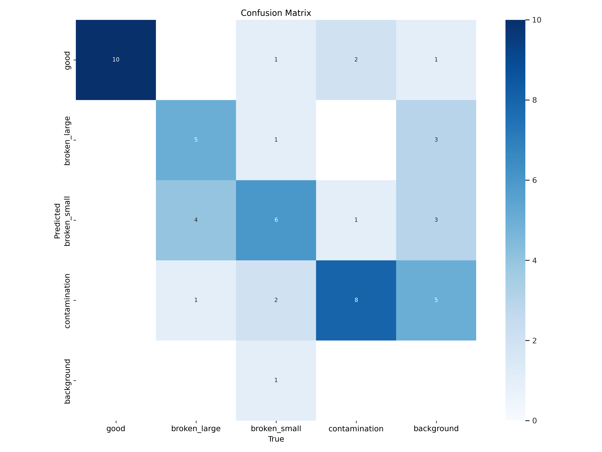
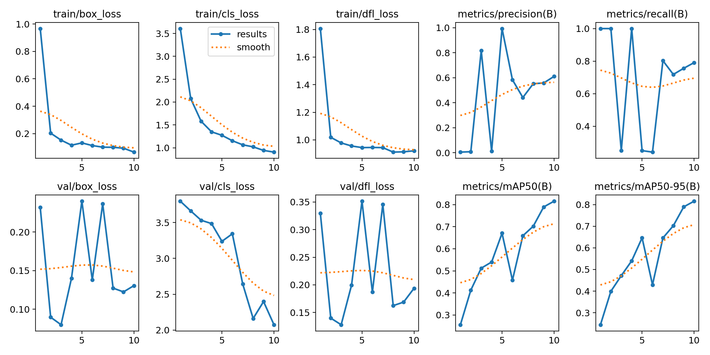
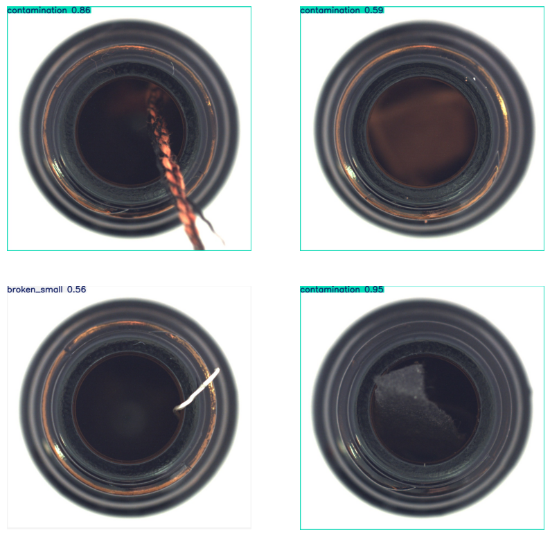
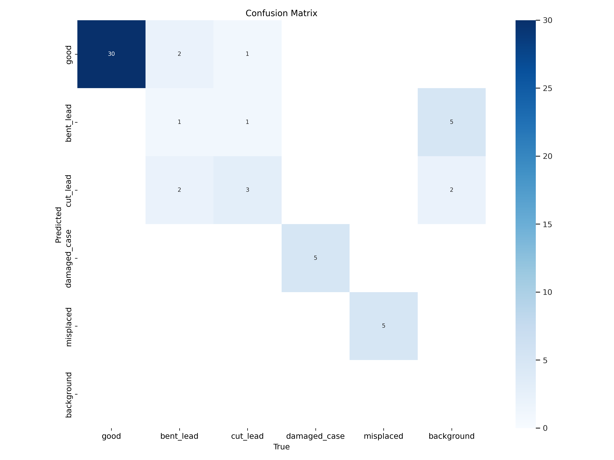
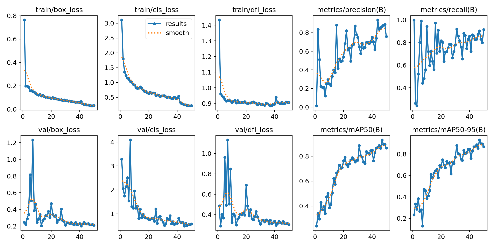
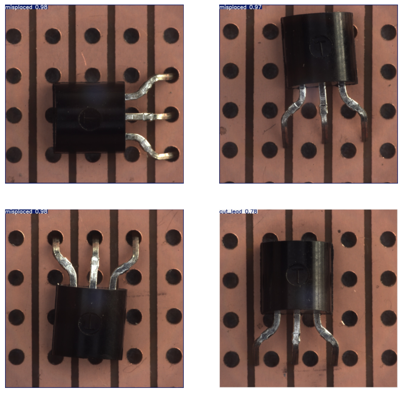
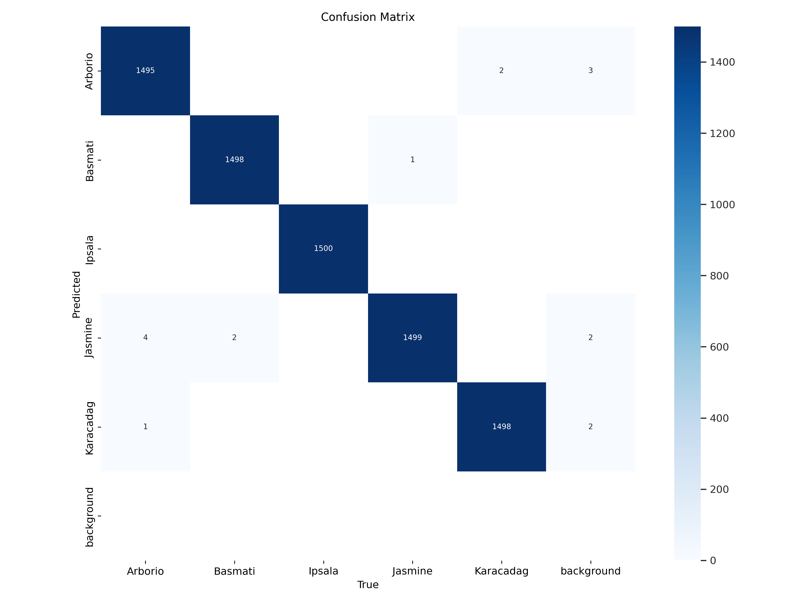
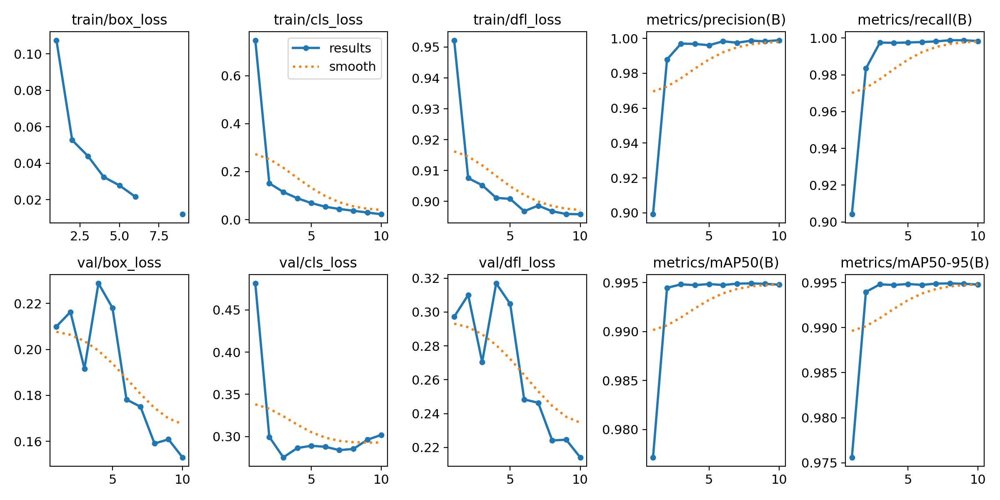

# Ultralytics YOLO for classification

**Objectives**
1. Take a look MVTec AD (MVTec Anomaly Detection) dataset for training and predict bottle classification.
2. Take a look MVTec AD (MVTec Anomaly Detection) dataset for training and predict transistor classification.
3. Develop a continuous training flow to export and import intermediate training data, instead of always from the begining steps.
4. Trying to find the optimized hyperparameters or algorithms for high accuracy (95%+) and low cls_loss (10%-).

# Pre-trained YOLO models we use
## YOLOv11 Model Comparison Table

| Feature                 | yolo11n.pt                 | yolo11s.pt                 | yolo11m.pt                 |
|--------------------------|----------------------------|----------------------------|----------------------------|
| **Input Resolution**      | 416x416                    | 416x416                    | 416x416                    |
| **Parameters (Approx.)**  | 6.8 M                      | 15.7 M                     | 53.0 M                     |
| **FLOPs (Approx.)**       | 4.5 TFLOPS                 | 9.9 TFLOPS                 | 31.9 TFLOPS                 |
| **Speed (FPS - RTX 3080)** | High (100+)                 | Medium (50-100)             | Low (10-50)                 |
| **Accuracy (mAP)**        | Lower                      | Moderate                    | Higher                      |
| **Target Hardware**       | Mobile/Embedded Devices    | GPUs with Limited Memory    | High-Performance GPUs       |

**Explanation:**

* **Input Resolution:** All three models use the same input resolution of 416x416 pixels.
* **Parameters:** The number of parameters in the model directly affects its size and complexity. YOLOv11n.pt has the fewest parameters, making it suitable for mobile or embedded devices. YOLOv11m.pt has the most parameters, leading to higher accuracy but requiring more powerful hardware.
* **FLOPs:** FLOPs (Floating-point Operations) represent the computational complexity of the model. YOLOv11n.pt has the lowest FLOPs, allowing for faster inference on devices with limited processing power.
* **Speed:** Speed is measured in frames per second (FPS). YOLOv11n.pt is generally the fastest due to its lower complexity. YOLOv11m.pt is the slowest but offers the highest accuracy.
* **Accuracy:** Mean Average Precision (mAP) is a metric used to measure object detection accuracy. YOLOv11m.pt typically achieves the highest mAP due to its increased complexity. However, the difference in accuracy might be negligible for some applications.
* **Target Hardware:**  YOLOv11n.pt is well-suited for resource-constrained environments like mobile devices. YOLOv11s.pt offers a balance between speed and accuracy for GPUs with limited memory. YOLOv11m.pt is ideal for high-performance GPUs where maximizing accuracy is the priority.


# Configurations

**DEFAULT_PARAMS**
```py
DEFAULT_PARAMS = dict(
    model_names     = ["yolo11n.pt", 'yolo11s.pt', 'yolo11m.pt'],
    imgsizes        = [256, 512],
    optimizers      = ["SGD", "AdamW", "Adam"],
    learning_rates  = [0.01, 0.005, 0.001],
    batch_size      = 16, # Adjust this if OOM
    epochs          = 50,
    image_augments  = [False, True]
)
```

**Bottle classes**
```py
class_map = dict(
    good          = 0,
    broken_large  = 1,
    broken_small  = 2,
    contamination = 3
)
```
**Transistor classes**
```py
class_map = dict(
    good          = 0,
    bent_lead     = 1,
    cut_lead      = 2,
    damaged_case  = 3,
    misplaced     = 4
)
```

**Rice classes**
```py
class_map = dict(
    Arborio   = 0,
    Basmati   = 1,
    Ipsala    = 2,
    Jasmine   = 3,
    Karacadag = 4
)
```


# Example: model performance

## Bottle
**confusion_matrix**


**training_results**


**prediction**



## Transistor
**confusion_matrix**


**training_results**


**prediction**



## Rice
**confusion_matrix**


**training_results**


**prediction**


# Current Cross-model-parameter training results
**metrics/mAP50**


**val/cls_loss**


**prediction**

***The best mAP50 accuracy is***

**Try model here [best.pt](./models/bottle/Run8_yolo11n_512_SGD_Aug/best.pt)
```yaml
- run8: Run8_yolo11n_512_SGD_Aug
- accuracy: 0.98 mAP50
- loss: 0.58 cls_loss
- imgsz: 512
- optimizer: SGD
- epoch: 50/50
- lr: 0.01
- image augmentation: True
- yolo-model: yollo11n.pt
```


***The lowest val/cls_loss is***

**Try model here [best.pt](./models/bottle/Run7_yolo11n_512_SGD/best.pt)
```yaml
- run7: Run7_yolo11n_512_SGD
- accuracy: 0.95 mAP50
- loss: 0.26 cls_loss
- imgsz: 512
- optimizer: SGD
- epoch: 44/50
- lr: 0.01
- image augmented: False
- yolo-model: yollo11n.pt
```

# Conclusion
- Partially meet the goal, that found out some parameter combination can meet the accuracy 95%+ from the following best runs
  - Run8_yolo11n_512_SGD_Aug (0.98 mAP50)
  - Run7_yolo11n_512_SGD (0.96 mAP50)
  - Run32_yolo11m_512_SGD_Aug (0.96 mAP50)

- `Missed` the goal on the loss value, every loss value within each run was higher than at least 20%, here are the top 3 lowest runs
  - Run7_yolo11n_512_SGD (0.26 val/cls_loss)
  - Run14_yolo11s_256_SGD_Aug (0.37 val/cls_loss)
  - Run32_yolo11m_512_SGD_Aug (0.40 val/cls_loss)


# References
- [Ultralytics YOLO Docs](https://docs.ultralytics.com/)
- [Ultralytics Github](https://github.com/ultralytics/ultralytics)
- [MVTecAD (MVTec Anomaly Detection)](https://www.kaggle.com/datasets/thtuan/mvtecad-mvtec-anomaly-detection)
- [Rice Image Dataset for Object Detection](https://www.kaggle.com/datasets/alikhalilit98/rice-image-dataset-for-object-detection)
